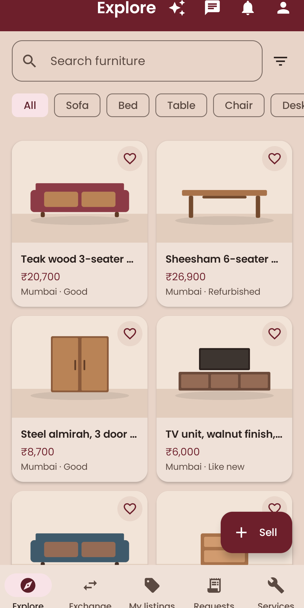
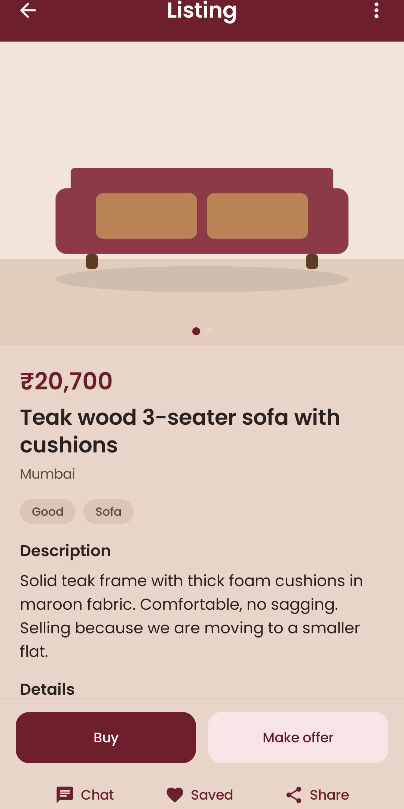
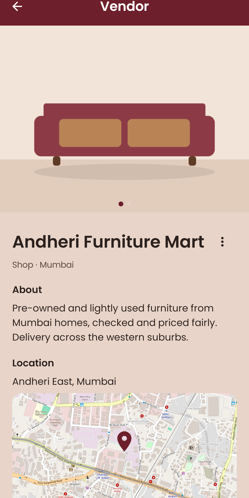
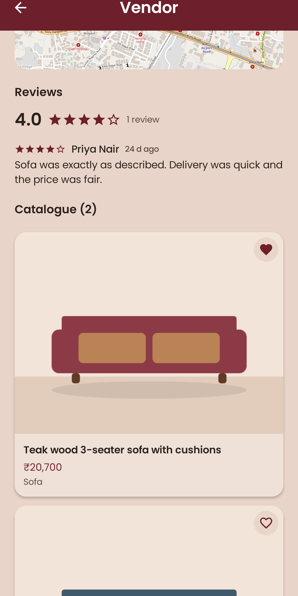
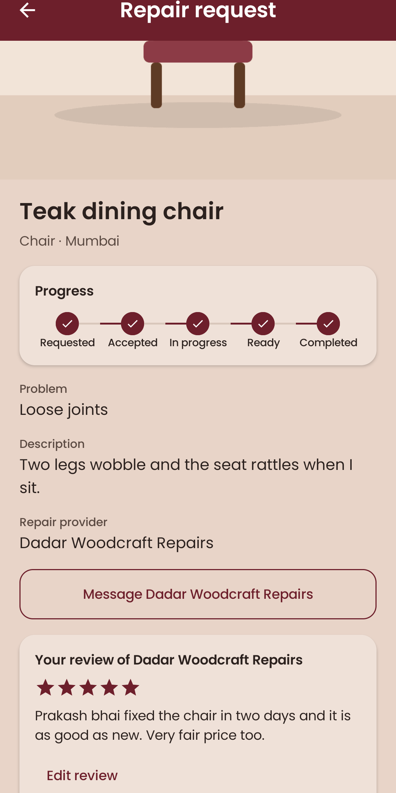
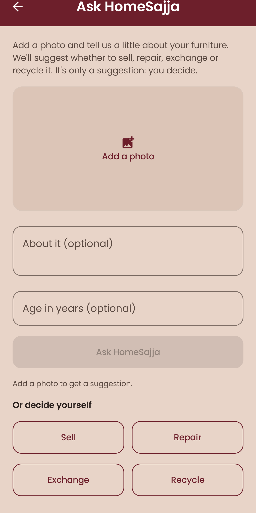
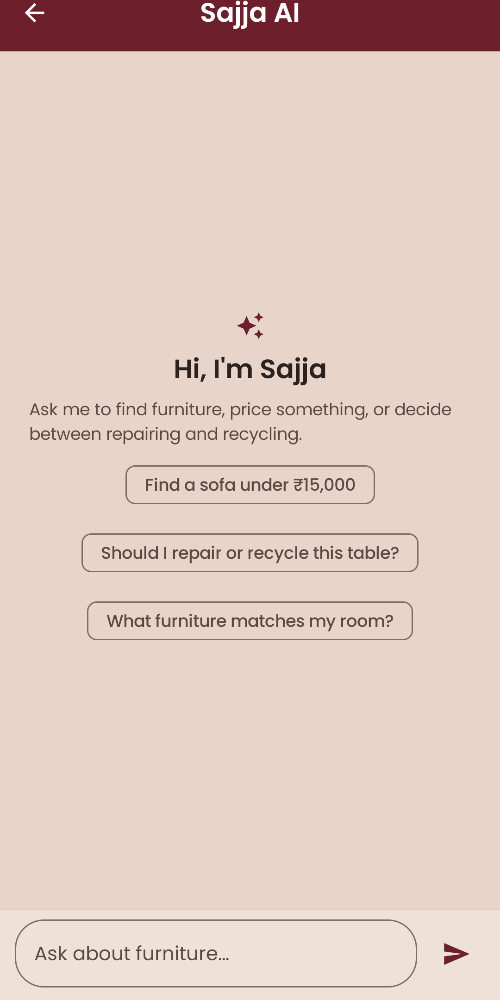
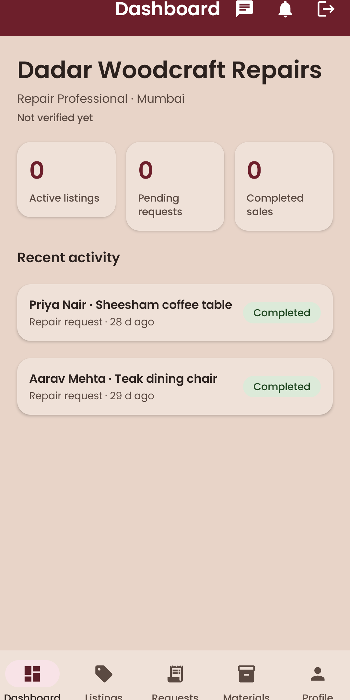

# HomeSajja

**Give furniture a second life.** HomeSajja is an Android app for the whole life of a piece of furniture:
**Buy, Sell, Exchange, Repair and Recycle**, connecting everyday users with local vendors (shopkeepers,
carpenters, repair professionals, refurbishers and recyclers) who can also source reusable materials through
Material Requests. Everyone picks one of two permanent roles at signup, **User** or **Vendor**, each with its
own space. Discovery is city-scoped (Mumbai, Pune, Bengaluru, Delhi, Hyderabad).

| Explore | Listing | Vendor profile | Reviews |
|---|---|---|---|
|  |  |  |  |

| Repair tracking | Ask HomeSajja | Sajja AI | Vendor dashboard |
|---|---|---|---|
|  |  |  |  |

## Features

**For users**
- **Buy and sell** with photo upload, filters, search, favourites (Saved), offers, and payment through **Google Pay (UPI)**
- **Exchange** items with other people, with an accept/decline flow
- **Repair**: describe the damage, choose a repair provider in your city, follow *Requested → Accepted → In progress → Ready → Completed*
- **Recycle**: pickup or drop-off, followed through *Requested → Accepted → Scheduled → Completed*
- **Ask HomeSajja**: a photo and a few notes get a Sell / Repair / Exchange / Recycle suggestion with a rupee price range, and open the right flow pre-filled
- **Sajja AI**: a chat assistant that knows your city and the listings around you
- **Chat** in real time, and **notifications** for messages and every request update
- **Reviews and ratings** after a completed transaction; **report** and **block** tools; in-app **account deletion**

**For vendors**
- Dashboard with active listings, pending requests, completed sales and recent activity
- Listing management (add, edit, delete, mark unavailable), one place for incoming purchase, exchange, repair and recycling requests
- Public shop profile with a map pin (OpenStreetMap), brochure photos, ratings, reviews and a Verified badge
- Material Requests: post what you need, and accept or decline offers from users

## Tech stack

- **Language & UI:** Kotlin, Jetpack Compose, Material 3
- **Architecture:** MVVM (ViewModel + StateFlow), Coroutines, Repository pattern, manual DI (`di/AppContainer`)
- **Backend:** Firebase Authentication, Cloud Firestore (security rules enforce every status pipeline), Cloud Messaging
- **Photos:** Cloudinary free tier (unsigned uploads, no secret in the app)
- **AI:** Google Gemini through **Firebase AI Logic** (the key stays with Firebase, never in the app)
- **Maps:** OpenStreetMap through osmdroid (no API key or billing)
- **Payments:** a standard `upi://pay` link opened in Google Pay; the buyer or seller marks the request paid

Every system (Marketplace, Exchange, Repair, Recycle, Material Requests) has its own models, collection,
ViewModels, screens and status pipeline; only small UI parts (photo picker, status badge, chat) are shared.

## Set up and run

You need Android Studio (JDK 17 for the app; JDK 21 for the Firebase emulator tests) and Node 18+.

```bash
git clone https://github.com/Ashwika05-star/HomeSajja.git
```

1. **Firebase:** create a project, add an Android app with package `com.homesajja.app`, download `google-services.json` into `app/`
   (it is git-ignored). Enable **Authentication** (Email/Password and Google), **Firestore**, and
   **AI Logic** (Build → AI Logic → Get started → Gemini Developer API).
2. **Web client id:** put the Google "Web client" OAuth id into `default_web_client_id` in `app/src/main/res/values/strings.xml`.
3. **Photos:** create a free Cloudinary account and an *unsigned* upload preset named `homesajja_listings`; put your cloud name
   in `cloudinary_cloud_name` in `strings.xml`.
4. **Rules and indexes:** `firebase deploy --only firestore --project <your-project>`
5. Run the app from Android Studio, or `./gradlew installDebug`.

### Try it without a real Firebase project

```bash
firebase emulators:start --only auth,firestore --project homesajja-placeholder
./gradlew installDebug -PuseEmulator=true
```

### Demo data

`tools/seed-demo-data` fills a project (or the emulators) with about 45 listings across five cities, 15 users, 17 vendors,
material requests and finished jobs with reviews. See its README. Every demo account uses the password
`HomeSajja#Demo1`, for example `demo.aarav@homesajja.demo` (user) and `demo.dadarwood@homesajja.demo` (repair vendor).

## Testing

```bash
./gradlew testDebugUnitTest            # unit tests (logic, parsing, colour contrast, UPI links, notifications...)
cd firestore-rules-tests && npm install && npm test    # 249 security-rules checks against the Firestore emulator
```

`docs/quality-audit.md` records the state-handling, accessibility and performance audit and the final QA results.

## Releasing

`play-store/README.md` walks through building the signed bundle (`./gradlew bundleRelease`) and uploading it to
Google Play's internal testing track. Store text, the privacy policy, Data safety answers and graphics are in `play-store/`.

## Push notifications

Notifications are written by the app and shown in the app, plus as system alerts while the app is running. Delivering a push to
a fully closed app needs the small Cloud Function in `functions/`, which requires Firebase's paid (Blaze) plan; it is written and
tested on the emulator but not deployed.
