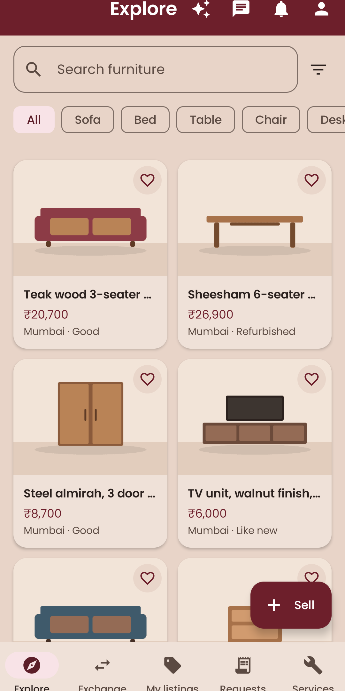
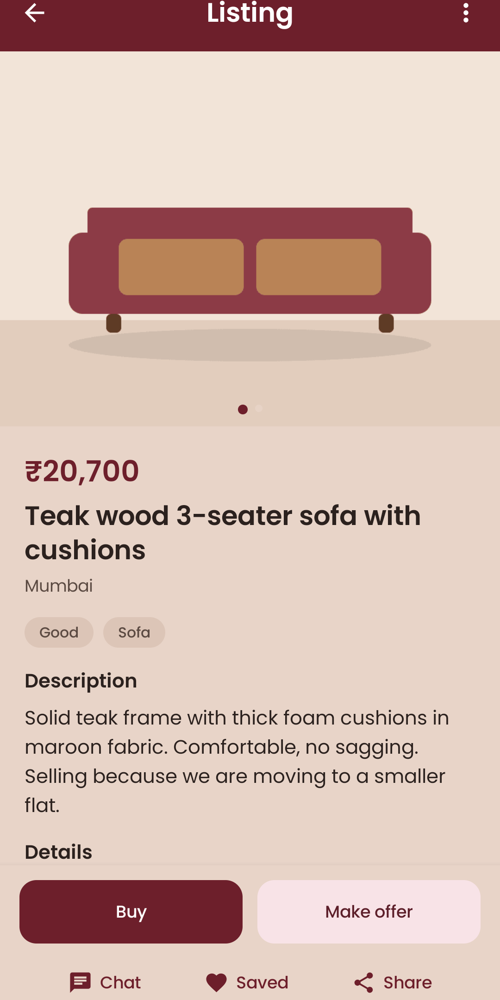
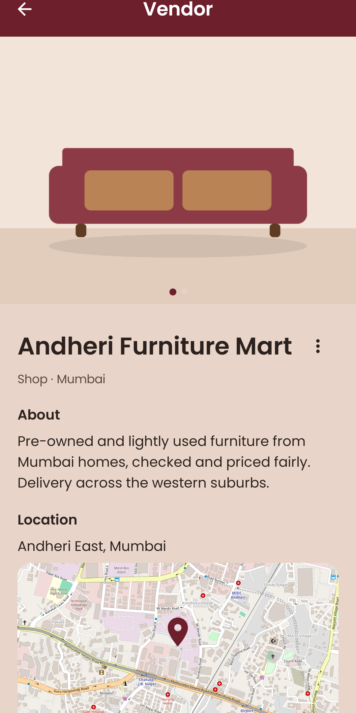
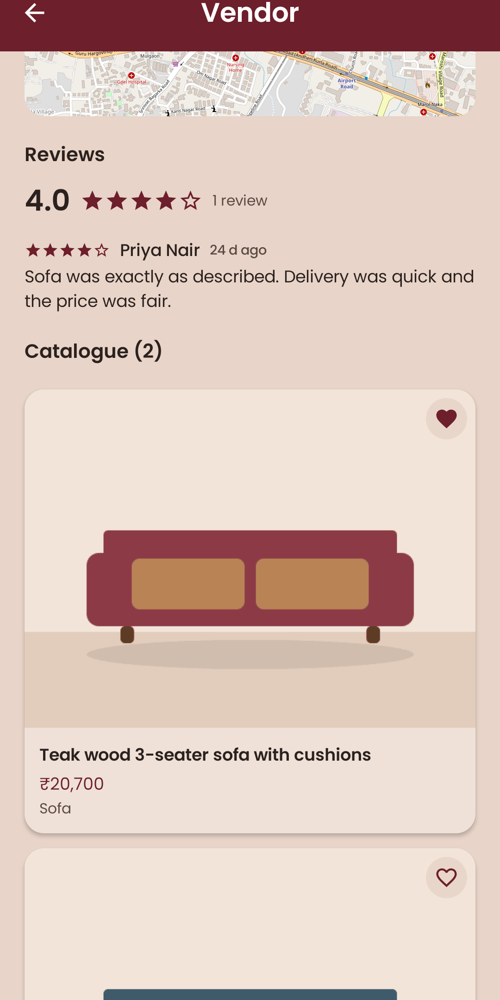
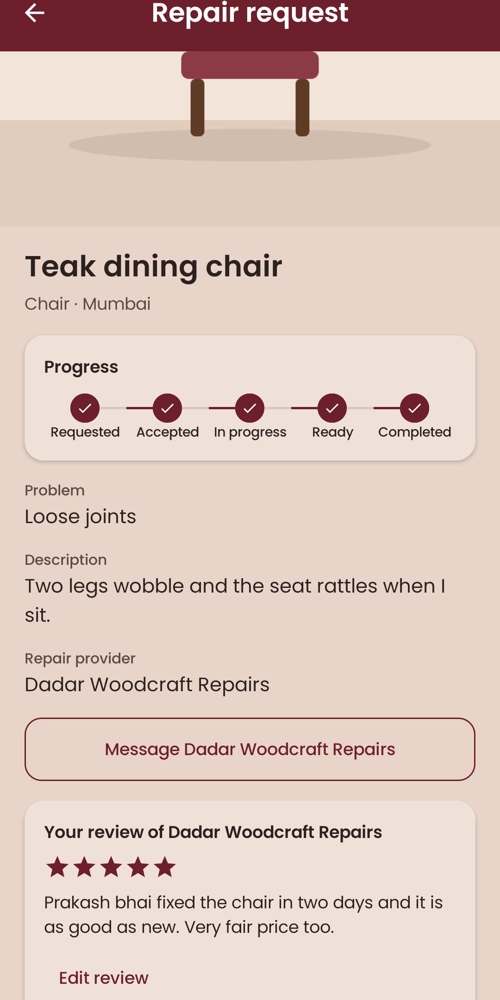
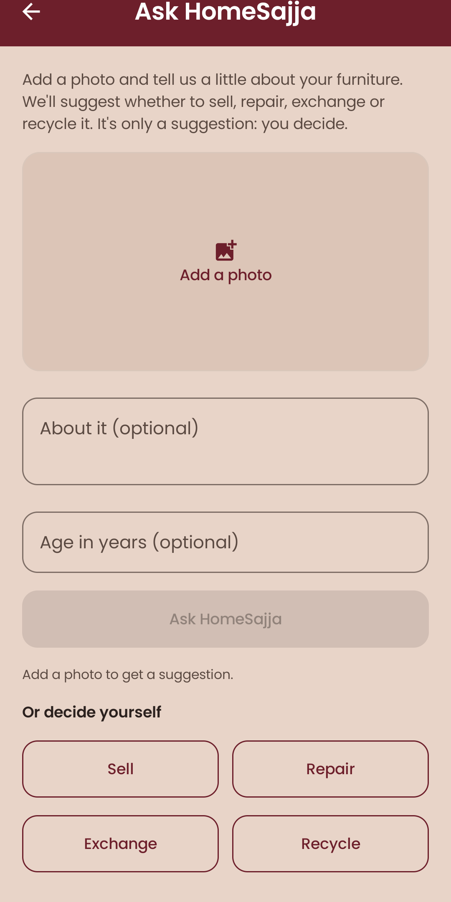
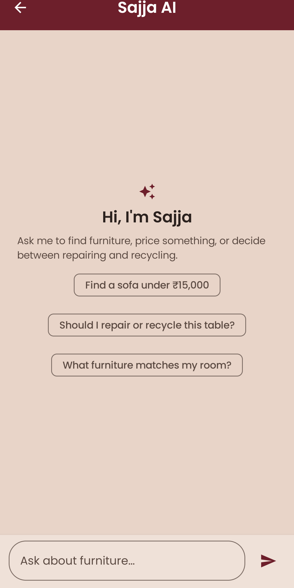
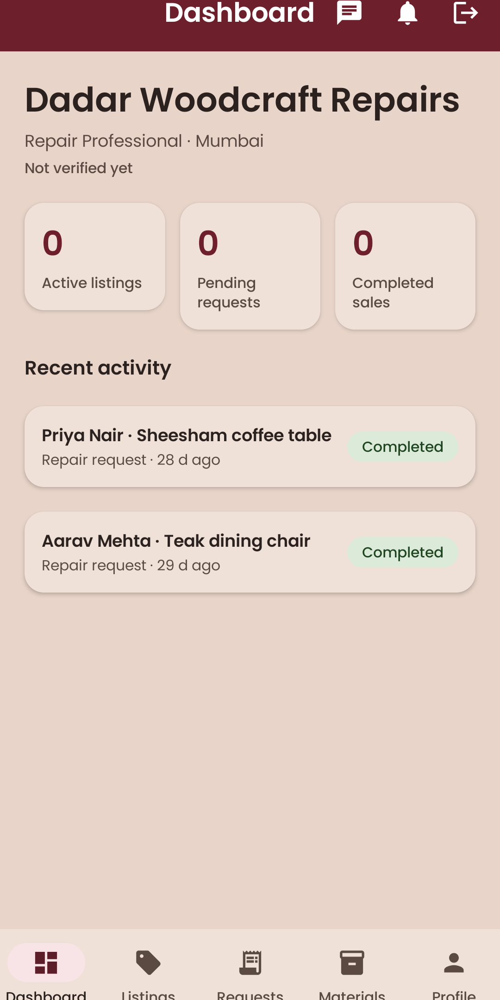

# HomeSajja

**Give furniture a second life.** HomeSajja is an Android app for the whole life of a piece of furniture:
**Buy, Sell, Exchange, Repair and Recycle**, connecting everyday users with local vendors (shopkeepers,
carpenters, repair professionals, refurbishers and recyclers) who can also source reusable materials through
Material Requests. Everyone picks one of two permanent roles at signup, **User** or **Vendor**, each with its
own space. Discovery is city-scoped (Mumbai, Pune, Bengaluru, Delhi, Hyderabad).

| Explore | Listing | Vendor profile | Reviews |
|---|---|---|---|
|  |  |  |  |

| Repair tracking | Ask HomeSajja | Sajja AI | Vendor dashboard |
|---|---|---|---|
|  |  |  |  |

## Features

**For users**
- **Buy and sell** with photo upload, filters (category, price, condition, Individual / Vendor sellers), search, your own listings badged in the feed, favourites (Saved), offers, quotes and agreed prices, and payment by **UPI (any UPI app, QR code) or cash**
- **Exchange** items with other people, with an accept/decline flow
- **Repair**: describe the damage, choose a repair provider in your city, follow *Requested → Accepted → In progress → Ready → Completed*
- **Recycle**: pickup or drop-off, followed through *Requested → Accepted → Scheduled → Completed*
- **Ask HomeSajja**: a photo and a few notes get a Sell / Repair / Exchange / Recycle suggestion with a rupee price range, and open the right flow pre-filled
- **Sajja AI**: a chat assistant that knows your city and the listings around you
- **Chat** in real time, and **notifications** for messages and every request update
- **Reviews and ratings** after a completed transaction; **report** and **block** tools; in-app **account deletion**

**For vendors**
- Dashboard with active listings, pending requests, completed sales and recent activity
- Listing management (add, edit, delete, mark unavailable), one place for incoming purchase, exchange, repair and recycling requests
- Public shop profile with a map pin (OpenStreetMap), brochure photos, ratings, reviews and a Verified badge
- Material Requests: post what you need, and accept or decline offers from users

## Tech stack

- **Language & UI:** Kotlin, Jetpack Compose, Material 3
- **Architecture:** MVVM (ViewModel + StateFlow), Coroutines, Repository pattern, manual DI (`di/AppContainer`)
- **Backend:** Firebase Authentication, Cloud Firestore (security rules enforce every status pipeline), Cloud Messaging
- **Photos:** Cloudinary free tier (unsigned uploads, no secret in the app)
- **AI:** Google Gemini through **Firebase AI Logic** (the key stays with Firebase, never in the app)
- **Maps:** OpenStreetMap through osmdroid (no API key or billing)
- **Payments:** a standard `upi://pay` link opened in the phone's UPI app chooser, plus a QR code made with ZXing's encoder; no payment gateway: the payer says "I've paid" and the payee confirms (see "Quotes, agreements and payments")

Every system (Marketplace, Exchange, Repair, Recycle, Material Requests) has its own models, collection,
ViewModels, screens and status pipeline; only small UI parts (photo picker, status badge, chat) are shared.

## Set up and run

You need Android Studio (JDK 17 for the app; JDK 21 for the Firebase emulator tests) and Node 18+.

```bash
git clone https://github.com/Ashwika05-star/HomeSajja.git
```

1. **Firebase:** create a project, add an Android app with package `com.homesajja.app`, download `google-services.json` into `app/`
   (it is git-ignored). Enable **Authentication** (Email/Password and Google), **Firestore**, and
   **AI Logic** (see "Turning on the AI features" below).
2. **Web client id:** put the Google "Web client" OAuth id into `default_web_client_id` in `app/src/main/res/values/strings.xml`.
3. **Photos:** create a free Cloudinary account and an *unsigned* upload preset named `homesajja_listings`; put your cloud name
   in `cloudinary_cloud_name` in `strings.xml`.
4. **Rules and indexes:** `firebase deploy --only firestore --project <your-project>`
5. Run the app from Android Studio, or `./gradlew installDebug`.

### Google sign-in on each machine and for the release build

Google sign-in works only for a build whose **signing key's SHA fingerprints are registered** on the Firebase Android app (email login
needs nothing). Every teammate's Mac has its own debug key, and the Play release has its own, so each one is added once:

```bash
# print this machine's debug fingerprints (look for SHA1 and SHA256)
keytool -list -v -keystore ~/.android/debug.keystore -alias androiddebugkey -storepass android -keypass android | grep -E "SHA1|SHA256"
# register them (needs `firebase login`); repeat for the SHA-1 and the SHA-256, and for the release key
firebase apps:android:sha:create <firebase-android-app-id> <SHA> --project <project-id>
# then refresh the config and replace app/google-services.json with it
firebase apps:sdkconfig android <firebase-android-app-id> --project <project-id> -o app/google-services.json
```

Or in the console: Project settings → Your apps → HomeSajja (Android) → **Add fingerprint**, then **Download google-services.json**. If Google sign-in
fails, the app now says why on screen, and Logcat (tag `HomeSajjaGoogle`) prints the exact error plus *this build's* SHA-1 to register.
After you upload to Google Play, also add the **App signing** SHA-1 and SHA-256 shown in Play Console → Setup → App signing.

### Turning on the AI features

Firebase AI Logic must be switched on for the project, once (already done for `homesajja-9550a`). With the Firebase CLI:

```bash
firebase experiments:enable ailogic
firebase ailogic:providers:enable gemini-developer-api
firebase ailogic:config:set security.auth-only false
```

The last command creates the project's AI config (without it every request fails with "genai config not found"). The console route is
**Build → AI Logic → Get started → Gemini Developer API**. Until it is done the AI screens say "AI isn't switched on yet".

The model names are in `strings.xml`: `gemini_model` (`gemini-3.8-flash`), and `gemini_model_fallback` (`gemini-flash-latest`), which is tried when the first
model is retired or busy ("high demand"). Google retires models; `gemini-2.5-flash` is already gone for new projects, so check a name before changing it. Logcat tag `HomeSajjaAi` has the real errors.

### Quotes, agreements and payments

**Repair** runs `Requested → Quoted → Agreed → In progress → Ready → Completed`. After a user sends a request, the vendor sends a *quote*
(an amount in rupees, estimated days and an optional note). The user accepts it (**Agreed**) or declines it (**Quote declined**); after a decline
the vendor sends a revised quote or closes the request. The vendor can start work only after **Agreed**, and the agreed amount can't change after that.
(`ACCEPTED` is the old "accepted without a price" status: requests that were already there carry on as agreed jobs, but no new request reaches it.)

**Recycling** stays free by default (`Requested → Accepted → Scheduled → Completed`). A recycler may instead send a quote with an amount and a direction
(*customer pays the recycler* or *the recycler pays the customer*); the customer accepts it (**Accepted**, amount agreed) or declines it. A pickup can be
claimed "free" or "with a quote". **Purchases** keep their pipeline; when the seller accepts, the price (the asking price, or the accepted offer) becomes the
agreed amount. The notifications for a quote being sent, accepted, declined or revised, and for a payment being marked or confirmed, go to the other party.

**Payment record.** Every request with an amount stores a `payment` inside it: payer, payee, the payee's UPI ID (a snapshot), method (UPI or Cash), status
`Unpaid → Marked paid by payer → Confirmed received by payee`, an optional UPI transaction reference and the timestamps. Only the payer can mark it paid and
only the payee can confirm it. **Only the confirmation counts as money earned** (the vendor dashboard's "Earned" card). Nobody can cancel a job once a
payment is marked. `firestore.rules` enforces every one of these transitions and that `agreedAmount` and `quote` never change after the agreement
(see the 140+ new checks in `firestore-rules-tests`).

**UPI.** Users and vendors save a UPI ID on their profile (shown with a **Copy** button; the vendor's goes into their quotes, the user's is used when a recycler
pays them). The Pay button opens Android's chooser of all installed UPI apps, and says so if there is none (then the QR code, the copied ID or cash are the
alternatives). The QR code is drawn from [ZXing core](https://github.com/zxing/zxing) (`com.google.zxing:core`, Apache-2.0), only its encoder, no camera or UI code.
HomeSajja never moves money and has no payment gateway.

**Rolling it out.** The app and `firestore.rules` change together: deploy the rules (`firebase deploy --only firestore:rules`) before people use a build with this
upgrade, and expect older builds to be refused on the new repair, recycling and accept steps. No new index is needed. Purchase requests accepted before this upgrade
keep their old fields but have no payment record, so they can't be paid in the new way.

### Firestore indexes (Explore and Exchange browsing)

Browsing runs one Firestore query per page: `listings` where `city` and `status = ACTIVE` match, plus optionally `category`, `actionType`
and `sellerType` (the Individual / Vendor chips on Explore), ordered by `createdAt` descending. Every combination needs its own composite
index, all declared in `firestore.indexes.json`:

| Filters on top of `city` + `status` | Fields (then `createdAt` desc) |
|---|---|
| none | `city, status` |
| category | `city, status, category` |
| action type (Explore = SELL, Exchange = EXCHANGE) | `city, status, actionType` |
| category + action type | `city, status, category, actionType` |
| seller type | `city, status, actionType, sellerType` (as served by Explore) |
| seller type + category | `city, status, category, actionType, sellerType` |

The four `sellerType` rows are the ones added in Upgrade 2: `city, status, sellerType`, `city, status, category, sellerType`,
`city, status, actionType, sellerType` and `city, status, category, actionType, sellerType`. Deploy them with
`firebase deploy --only firestore:indexes --project <your-project>`; a new index takes a minute or two to build, and until it is ready
the feed shows the normal "Couldn't load listings" error with a Try again button. A unit test (`SellerTypeIndexTest`) fails if a filter
combination has no index. Listings written by the app always carry `sellerType`; a listing without that field would not match the
Individual / Vendor chips.

### Try it without a real Firebase project

```bash
firebase emulators:start --only auth,firestore --project <the project id in app/google-services.json>
./gradlew installDebug -PuseEmulator=true
```

### Demo data

`tools/seed-demo-data` fills a project (or the emulators) with about 45 listings across five cities, 15 users, 17 vendors,
material requests and finished jobs with reviews. See its README. Every demo account uses the password
`HomeSajja#Demo1`, for example `demo.aarav@homesajja.demo` (user) and `demo.dadarwood@homesajja.demo` (repair vendor).

## Testing

```bash
./gradlew testDebugUnitTest            # unit tests (logic, parsing, colour contrast, UPI links, notifications...)
cd firestore-rules-tests && npm install && npm test    # 390 security-rules checks against the Firestore emulator
```

`docs/quality-audit.md` records the state-handling, accessibility and performance audit and the final QA results.

## Releasing

`play-store/README.md` walks through building the signed bundle (`./gradlew bundleRelease`) and uploading it to
Google Play's internal testing track. Store text, the privacy policy, Data safety answers and graphics are in `play-store/`.

## Push notifications

Notifications are written by the app and shown in the app, plus as system alerts while the app is running. Delivering a push to
a fully closed app needs the small Cloud Function in `functions/`, which requires Firebase's paid (Blaze) plan; it is written and
tested on the emulator but not deployed.
